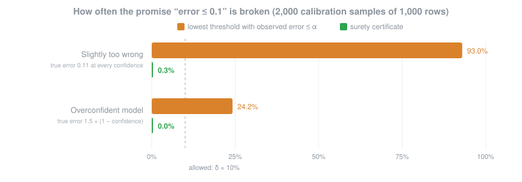
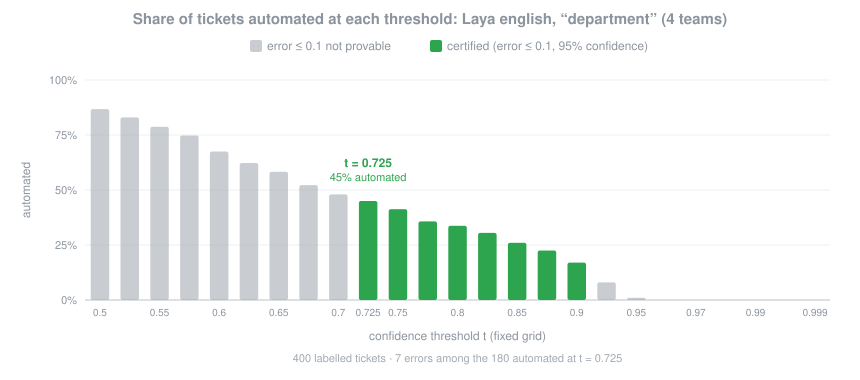

<p align="center">
  <picture>
    <source media="(prefers-color-scheme: dark)" srcset="assets/logo-dark.svg">
    
  </picture>
</p>

<h1 align="center">surety</h1>

<p align="center">
  <em>Your model says it's sure. surety checks.</em>
</p>

<p align="center">
  
  
  
  
  
</p>

<p align="center">
  <strong>error ≤ α among automated decisions, with probability ≥ 1 − δ &middot; fails closed &middot; zero dependencies</strong><br>
  <sub>Finite-sample, exact binomial guarantee per question, model and slice, from your own human-labelled traffic. <a href="#numbers">Numbers</a> &middot; <a href="docs/method.md">Method</a>.</sub>
</p>

---

Decision models like **Jev** and **Laya** don't write text. They return typed,
probabilistic decisions: route this ticket, flag this refund, score this
urgency. Both vendors give the same advice: *pick a confidence threshold and
check it on your own labelled data.*

Nobody tells you how many rows "check" takes, or how often a threshold that looked
fine on a few hundred tickets breaks in production. surety answers both. Give it
labelled traffic and a target error rate, and it hands back a threshold that comes
with a proof.

## Before / after

Real Laya answers to 400 labelled support tickets, routing each one to one of four teams.

Without surety, you eyeball it:

```text
threshold 0.5 → 26 errors in 347 automated tickets = 7.5%. Under 10%. Ship it.
```

With surety, you certify it:

```console
$ surety certify laya-answers.jsonl --questions questions.json --alpha 0.1 -o certs.json
department               None       t=0.725          automates  45.0% (7/180 errors in calibration)
is_refund                None       t=0.5            automates 100.0% (20/400 errors in calibration)
urgency                  None       NOT CERTIFIABLE  automates   0.0% (0/0 errors in calibration)
```

That 7.5% was measured on 347 tickets. The most surety can prove at t = 0.5, with
95% confidence, is an error rate of 12.5%. That isn't under 10%, so it raises the
`department` threshold to 0.725, where it can prove it. `urgency` gets no threshold:
every urgency decision goes to a person. That's the honest answer for 400
labelled rows.

## Install

```bash
git clone https://github.com/ElyasMoshirpanahi/surety && cd surety
python -m venv .venv && . .venv/bin/activate      # Windows: .venv\Scripts\activate
pip install -e ".[dev]"
```

The core is the standard library only. Add `[sdk]` for the official TypeSafe SDK or
`[laya]` to run Laya in-process. It isn't on PyPI yet, where it will publish as
`surety-gate`; the import and the command stay `surety`.

## 60-second quickstart

This runs offline on the bundled synthetic dataset, using a simulated backend:

```bash
surety plan --alpha 0.1
surety collect examples/jev_vs_laya/triage.jsonl --questions examples/jev_vs_laya/questions.json \
    --backend fake --model sim-1.0.0 -o calib.jsonl
surety certify calib.jsonl --questions examples/jev_vs_laya/questions.json --alpha 0.1 -o certs.json
surety report calib.jsonl --questions examples/jev_vs_laya/questions.json --alpha 0.1 -o report.md
```

Then gate decisions at runtime:

```python
import json
from surety import FakeBackend, Gate, Ledger

questions = json.load(open("examples/jev_vs_laya/questions.json"))
backend = FakeBackend("sim-1.0.0")  # live: HttpBackend(model="jev-1.13.0")
gate = Gate.load("certs.json", ledger=Ledger("decisions.jsonl"))

state = {"text": "I was charged twice this month. Please refund the charge."}
res = backend.predict(state, questions)
d = gate.decide("department", questions["department"], res["answers"]["department"], model=backend.model, state=state)
print(d.action, d.decision, round(d.confidence, 3), "-", d.reason)
```

```bash
surety verify decisions.jsonl          # the evidence chain is intact
surety ledger anchor decisions.jsonl   # publish this hash somewhere you don't control alone
```

## How it works

```text
1. collect   send labelled real traffic to the model, exactly as production does
2. certify   at each threshold on a fixed grid, test "error above t > α" exactly
             (binomial tail, Bonferroni over the grid); keep the lowest t that passes
3. gate      AUTOMATE only with a matching certificate, model, question and confidence;
             everything else → REVIEW
4. audit     label a random sample of automated decisions; an anytime-valid
             drift detector suspends the certificate when errors creep up
5. ledger    every decision and audit is hash-chained; anchor the tail hash
```

The gate **fails closed**. It sends a decision to review on any of these:

- unreadable answer
- no certificate
- reworded question
- different or moving model alias
- suspended certificate
- decision outside the actionable set
- confidence below the threshold

None of these cases can automate.

## Backends

| Backend | `surety collect` flags | Notes |
|---|---|---|
| Hosted Jev | `--backend http --model jev-1.13.0` | Reads `TYPESAFE_API_KEY` and sends it **only** to `api.typesafe.ai`. |
| Official SDK | `--backend sdk --model jev-1.13.0` | `pip install -e ".[sdk]"` |
| laya-serve | `--backend laya-serve --base-url http://localhost:8000 --model english@served` | Self-hosted. No key is sent. |
| Laya in-process | `--backend laya --model english@reviewed` | `pip install -e ".[laya]"` |
| Simulated | `--backend fake --model sim-1.0.0` | Offline tests and demos. |

`collect` runs requests concurrently. It retries 429, 5xx and network errors with
backoff, and `--resume` continues an interrupted run.

**Pin versions, always.** `jev-latest` can move without warning. Laya names like
`english` point at weights that can change, and every Laya checkpoint reports
itself as `laya-rl-agent`. So surety refuses aliases. It pins Laya as
`english@<commit sha>` and checks the routed checkpoint and the loaded revision on
every call.

## Commands

| Command | What it does |
|---|---|
| `surety plan --alpha A` | Fewest labelled rows that could certify, even with zero errors. |
| `surety collect DATA ...` | Answer labelled states with a backend. Concurrent, retrying, resumable. |
| `surety certify CALIB ...` | One certificate per question, model and slice. Add `--simultaneous` to make them all hold at once. |
| `surety report CALIB ...` | Markdown: the test at every threshold, plus reliability bins. |
| `surety verify LEDGER` | Check the hash chain. Any edited byte breaks it. |
| `surety ledger anchor LEDGER` | Verify, then print the record count and tail hash to publish. |

## Numbers

**Does the guarantee hold?** Draw a fresh calibration sample 2,000 times and
see how often the chosen threshold's *true* error rate exceeds α = 0.1:

<p align="center">
  
</p>

Picking the lowest threshold that *looks* fine breaks the promise up to 93% of
the time. surety stays under the δ = 10% it allows, because it's conservative by
construction. The same checks run in `pytest -m slow`.

**What does it buy on a real model?** Laya `english@55cf4c4e…` on CPU answered the
400 synthetic tickets in [`examples/jev_vs_laya`](examples/jev_vs_laya):

<p align="center">
  
</p>

Every green bar is a threshold where error ≤ 0.1 is proven. surety picks the
leftmost one, because it automates the most. More labelled rows push that bar
further left. Regenerate both charts with `python scripts/figures.py`.

## What the guarantee means, and doesn't

- **It assumes exchangeability.** Future traffic must look like the calibration
  sample, so sample it at random from real traffic. The drift monitor tells you
  when that stops being true.
- **Labels must come from humans,** never from the model being certified or a
  sibling model.
- **It holds per slice, not for every subgroup.** A certificate for `eu` says
  nothing about one country inside `eu`.
- **Score questions are certified on exact-match argmax.** Urgency 2 against a
  label of 3 is an error.

## FAQ

**Why not just use ECE?**
Expected calibration error averages over every confidence level. It doesn't bound
the error above *your* threshold, and it says nothing about how likely that bound
is to hold. `surety report` still shows reliability bins, but they don't decide anything.

**Why don't thresholds transfer between Jev and Laya?**
They're different models with different errors, and their `confidence` fields
are defined differently. Jev uses (n·p_max − 1)/(n − 1). Laya uses 1 − normalized
entropy. surety uses neither; it reads the probability of the argmax decision.
Each model still needs its own certificate. Compare them with
`python examples/jev_vs_laya/run.py --fake`.

**Why must I pin model versions?**
A certificate is about one set of weights. If the weights move, the proof is about
a different model.

**How many labelled rows?**
Run `surety plan --alpha 0.05`; at δ = 0.05 the answer is 122, with zero errors. Budget 2–3× that per
question and slice.

## Development

```bash
ruff check . && ruff format --check . && mypy
pytest -m "not slow"     # fast, offline
pytest -m slow           # Monte Carlo checks of the guarantee and drift detector

# live Laya (CPU is fine): needs `pip install "laya[serve]"` and torch
LAYA_REVISION=reviewed LAYA_MODELS=english laya-serve &
SURETY_LAYA_URL=http://127.0.0.1:8000 SURETY_LAYA_INPROCESS=1 pytest -m laya
```

CI runs lint, types and the fast tests on every push, and the slow simulations and
the live Laya job weekly. To run the same jobs locally in Docker:

```bash
bash ci/local.sh          # lint, types and tests on Python 3.10–3.13
bash ci/local.sh slow     # Monte Carlo checks
bash ci/local.sh laya     # live Laya on CPU, weights cached in a Docker volume
bash ci/local.sh all
``` See [CONTRIBUTING.md](CONTRIBUTING.md) and
[docs/method.md](docs/method.md).

## License

Apache-2.0. See [LICENSE](LICENSE).

<sub>Not affiliated with, or endorsed by, TypeSafe AI or Convai Innovations. Jev and Laya are named only to describe compatibility.</sub>
